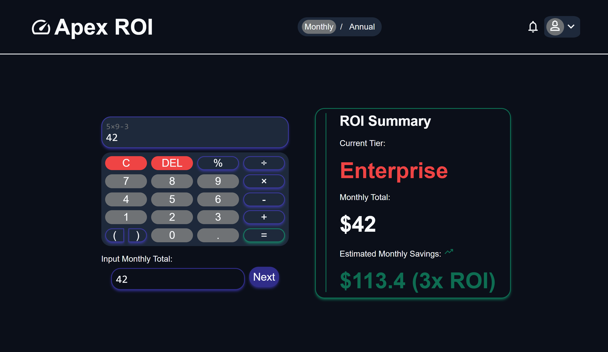
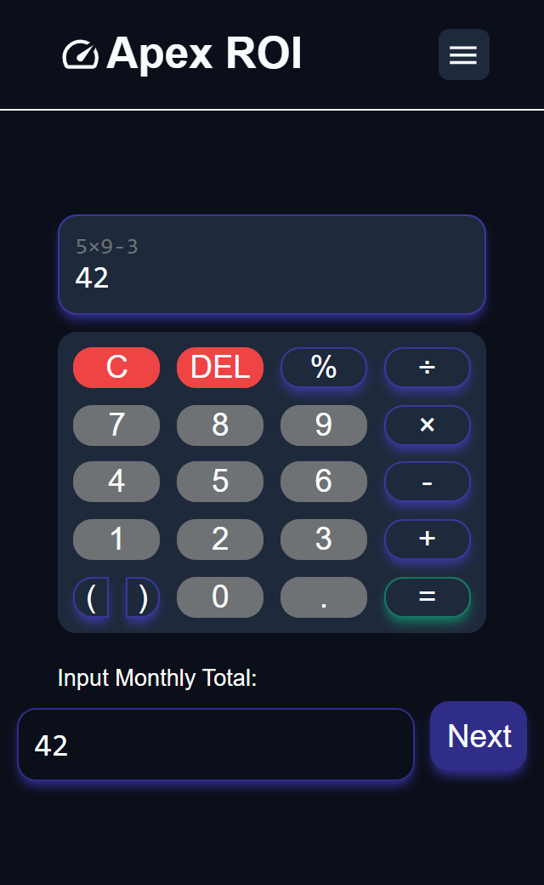

# Apex ROI

Apex ROI is a responsive SaaS-inspired ROI calculator built with **HTML, CSS, and Vanilla JavaScript**. The application allows users to calculate monthly or annual return on investment while providing a modern dashboard experience with multiple calculator tiers, live analytics, and interactive UI components.

> **Note:** The initial UI concept was generated with Google's Gemini AI. The complete frontend implementation, responsive design, functionality, and application logic were built by me.

---

## Preview



---



---

## Features

### Calculator
- Standard, Pro, and Enterprise calculator modes
- Dynamic calculator layout based on selected plan
- Real-time expression evaluation
- Automatic formatting using `toLocaleString()`
- Support for:
  - Percentages
  - Brackets
  - Decimal numbers
  - Negative numbers
  - Multiplication and Division symbols
- Expression validation
- Prevents invalid operator sequences
- Balanced bracket validation
- Smart decimal handling
- Delete and Clear functionality

---

### Analytics Dashboard
- Live ROI summary
- Monthly and Annual calculations
- Estimated savings calculation
- Tax deduction toggle
- Plan-based analytics

---

### User Interface
- Responsive design
- Mobile sidebar
- Profile panel
- Notification panel
- History panel
- Glassmorphism effects
- Custom typography
- Smooth animations
- Dark theme

---

## Technologies Used

- HTML5
- CSS3
- Vanilla JavaScript (ES6+)
- CSS Grid
- Flexbox
- CSS Variables
- CSS Layers
- Event Delegation
- Responsive Design

---

## Project Structure

```
Apex-ROI/
│
├── index.html
│
├── css/
│   ├── animation.css
│   ├── base.css
│   ├── main.css
│   ├── navbar.css
│   ├── plan.css
│   ├── sidebar.css
│   └── view.css
│
├── js/
│   ├── base.js
│   ├── ui.js
│   ├── calculator.js
│   └── analytics.js
│
├── fonts/
└── assets/
```

---

## What I Learned

Building this project helped me gain practical experience with:

- DOM Manipulation
- Event Delegation
- Dynamic UI Generation
- JavaScript State Management
- Responsive Layout Design
- Modular CSS
- Modular JavaScript
- Form Validation
- Expression Parsing
- Calculator Logic
- Project Organization

---

## Challenges

Some of the challenges I solved while building Apex ROI include:

- Preventing invalid mathematical expressions
- Handling decimal edge cases
- Supporting negative numbers
- Validating balanced brackets
- Building different calculator layouts dynamically
- Managing calculator history
- Creating responsive layouts for desktop and mobile
- Organizing the project into reusable CSS and JavaScript modules

---

## Future Improvements

- User authentication
- Save calculation history using Local Storage
- Export calculation reports
- Currency selector
- Theme switcher
- Multiple ROI calculation models
- Charts and data visualization
- Backend integration

---

## Author

**Joseph Nduonyi**

---

> **Note:** This is my first JavaScript project, created after learning the fundamentals of JavaScript. It focuses on applying core concepts such as DOM manipulation, event delegation, validation, responsive design, and modular project organization in a real-world application.
